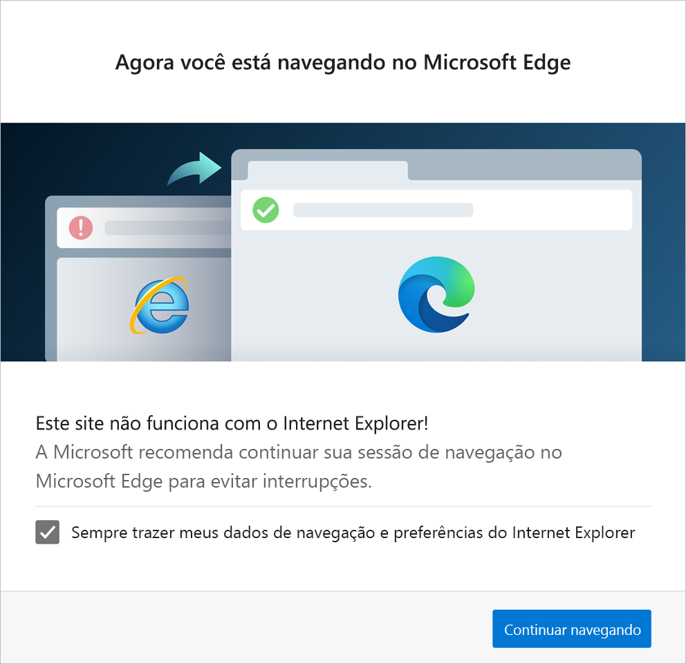

# Redirecionamento do Internet Explorer para o Microsoft Edge para compatibilidade com os sites modernos

> [!NOTE]
> Este artigo se aplica ao Microsoft Edge Estável versão 87 ou posterior.

## Visão Geral

>[!Note]
> O aplicativo de área de trabalho Internet Explorer 11 será desativado e ficará sem suporte em 15 de junho de 2022 (para obter uma lista do que está no escopo, [consulte as Perguntas frequentes](https://techcommunity.microsoft.com/t5/windows-it-pro-blog/internet-explorer-11-desktop-app-retirement-faq/ba-p/2366549)). Os mesmos aplicativos e sites do IE11 que você usa hoje podem abrir no Microsoft Edge com o modo Internet Explorer. [Saiba mais aqui](https://blogs.windows.com/windowsexperience/2021/05/19/the-future-of-internet-explorer-on-windows-10-is-in-microsoft-edge/).

Muitos sites modernos têm designs incompatíveis com o Internet Explorer. Sempre que um usuário do Internet Explorer visita um site público incompatível, ele recebe uma mensagem informando que o site não é compatível com seu navegador e que precisa mudar manualmente para um navegador diferente.

A necessidade de mudar manualmente para um navegador diferente muda a partir da versão 87 do Microsoft Edge Estável.

Quando o usuário visita um site incompatível com o Internet Explorer, ele será automaticamente redirecionado para o Microsoft Edge. Este artigo descreve a experiência do usuário para o redirecionamento e as políticas de grupo que são utilizadas para configurar ou desativar o redirecionamento automático.

> [!NOTE]
> A Microsoft mantém uma lista de todos os sites que são conhecidos por não serem compatíveis com o Internet Explorer. Para obter mais informações, consulte [Solicitar atualizações à lista de sites incompatíveis](/microsoft-edge/web-platform/ie-to-microsoft-edge-redirection#request-an-update-to-the-ie-compatibility-list)

## Pré-requisitos
- Versão 87 estável ou posterior do Microsoft Edge
- Versões do Windows
    - Windows 10 versão 1709 ou posterior
    - Windows 8.1
    - Windows 7

## Experiência de redirecionamento

No redirecionamento para o Microsoft Edge, os usuários veem uma única vez a caixa de diálogo na próxima captura de tela. Este diálogo explica porque eles estão sendo redirecionados e solicita o consentimento para copiar seus dados de navegação e preferências do Internet Explorer para o Microsoft Edge. Os seguintes dados de navegação serão importados: Favoritos, senhas, mecanismos de busca, guias abertas, histórico, configurações, cookies e a Página Inicial.

Mesmo não dando seu consentimento ao marcar "Sempre traga meus dados de navegação e preferências do Internet Explorer", eles podem clicar em **Continuar navegação** para continuar sua sessão.

Finalmente, um banner de incompatibilidade do site, exibido na próxima captura de tela, aparece abaixo da barra de endereços para cada redirecionamento.

O banner de incompatibilidade do site:

- incentiva o usuário a mudar para o Microsoft Edge
- oferece para definir o Microsoft Edge como navegador padrão
- dá ao usuário a opção de explorar o Microsoft Edge

Quando um site é redirecionado do Internet Explorer para o Microsoft Edge, a guia do Internet Explorer que começou a carregar o site é fechada se não tiver nenhum conteúdo anterior. Caso contrário, a visualização da guia ativa vai para uma  página de  [suporte](https://support.microsoft.com/office/the-website-you-were-trying-to-reach-doesn-t-work-with-internet-explorer-8f5fc675-cd47-414c-9535-12821ddfc554?ui=en-US&rs=en-US&ad=US) da Microsoft que explica por que o site foi redirecionado para o Microsoft Edge.

> [!NOTE]
> Após o redirecionamento, os usuários podem voltar a usar o Internet Explorer para sites que não estão na lista de incompatibilidades do Internet Explorer.  

## Políticas de configuração do redirecionamento para o Microsoft Edge

> [!NOTE]
> Essas políticas estarão disponíveis como atualizações de arquivo ADMX em 26 de outubro de 2020 e no Intune em 9 de novembro de 2020.

Três políticas de grupo devem ser configuradas para permitir o redirecionamento automático para a Microsoft Edge. Estas políticas são:

- RedirectSitesFromInternetExplorerPreventBHOInstall
- RedirectSitesFromInternetExplorerRedirectMode
- HideInternetExplorerRedirectUXForIncompatibleSitesEnabled

### Política: RedirectSitesFromInternetExplorerPreventBHOInstall

O redirecionamento do Internet Explorer para o Microsoft Edge requer um Objeto Auxiliar de Navegador do Internet Explorer (BHO) chamado "IEtoEdge BHO". A política **RedirectSitesFromInternetExplorerPreventBHOInstall** controla se o BHO está ou não instalado.  

- Se você ativar esta política, o BHO necessário para o redirecionamento não será instalado e seus usuários continuarão a ver mensagens de incompatibilidade para certos sites no Internet Explorer. Se o BHO já estiver instalado, ele será desinstalado na próxima vez em que o canal do Microsoft Edge Estável for atualizado.
- Se você desativar ou não configurar esta política, o BHO será instalado. Este é o comportamento padrão.

Além de precisar do BHO, há uma dependência do **RedirectSitesFromInternetExplorerRedirectMode**, que precisa ser definida como "Redirecionar sites com base em sites compatíveis com sites" ou "Não Configurado".

### Política: RedirectSitesFromInternetExplorerRedirectMode

 Esta política corresponde à configuração do Microsoft Edge **Navegador padrão** "Permitir que o Internet Explorer abra sites no Microsoft Edge". Você pode acessar essa configuração indo para o URL *edge://settings/defaultbrowser*.  

- Se você não configurar esta política ou defini-la como "Sitelist", o Internet Explorer redirecionará os sites incompatíveis para o Microsoft Edge. Este é o comportamento padrão.
- Para desabilitar essa política, marque a **Habilitada** e, em seguida, na lista suspensa em opções: Redirecione sites incompatíveis do Internet Explorer para o Microsoft Edge, selecione **Desabilitar**. Nesse estado, os sites incompatíveis não serão redirecionados para o Microsoft Edge.

> [!NOTE]
> Se estiver em um dispositivo pessoal que não é gerenciado pela sua organização, você verá outra configuração chamada "Permitir que sites sejam carregados no modo Internet Explorer" em **Compatibilidade com o Internet Explorer**.
>
>Se você estiver em um dispositivo associado ao domínio ou registrado no Mobile Device Management (MDM), não verá esta opção.
>
> Em vez disso, se você quiser permitir que seus usuários carreguem sites no modo Internet Explorer, você pode fazê-lo configurando a política [Permitir o Internet Explorer no modo teste](./microsoft-edge-policies.md#intranetredirectbehavior).

### Política: HideInternetExplorerRedirectUXForIncompatibleSitesEnabled

Esta política configura a experiência do usuário com o redirecionamento de sites incompatíveis para o Microsoft Edge.  

- Se você ativar esta política, os usuários nunca verão a caixa de diálogo de redirecionamento e nem o banner de redirecionamento. Nenhum dado do navegador ou preferências do usuário serão importados.
- Se você desabilitar ou não configurar esta política, a caixa de diálogo de redirecionamento será exibida no primeiro redirecionamento e o banner de redirecionamento persistente será exibido nas sessões que começam com um redirecionamento.

  > [!NOTE]
  > Os dados de navegação do usuário serão importados sempre que o usuário encontrar um novo redirecionamento. Entretanto, isso só acontecerá se o usuário consentir a importação na caixa de diálogo de redirecionamento.

## Desative o redirecionamento para o Microsoft Edge

Se você quiser desativar o redirecionamento ANTES da atualização para o Microsoft Edge Estável versão 87, siga o seguinte passo:

1. Defina a política **RedirectSitesFromInternetExplorerPreventBHOInstall** para **Habilitada**.

Se você quiser desativar o redirecionamento DEPOIS da atualização para o Microsoft Edge Estável versão 87, siga os seguintes passos:

1. Defina a política **RedirectSitesFromInternetExplorerRedirectMode** para **Habilitado** E, em seguida, na lista suspensa em opções: Redirecione sites incompatíveis do Internet Explorer para o Microsoft Edge, selecione **Desabilitar**. Esta configuração deixará de redirecionar assim que a política entrar em vigor.
2. Defina a política **RedirectSitesFromInternetExplorerPreventBHOInstall** para **Habilitada**. Isto vai desinstalar o BHO depois da próxima atualização do Microsoft Edge.

## Consulte também

- [Solicitar atualizações à lista de sites incompatíveis](/microsoft-edge/web-platform/ie-to-microsoft-edge-redirection#request-an-update-to-the-ie-compatibility-list)
- [Página de destino do Microsoft Edge Enterprise](https://aka.ms/EdgeEnterprise)
- [Políticas do Microsoft Edge](./microsoft-edge-policies.md)